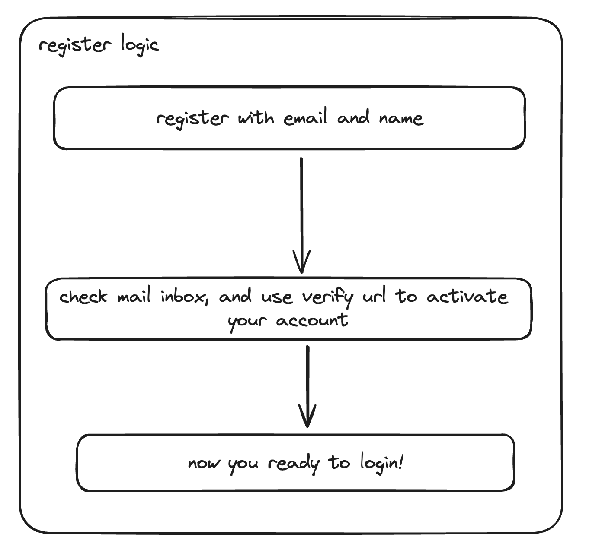
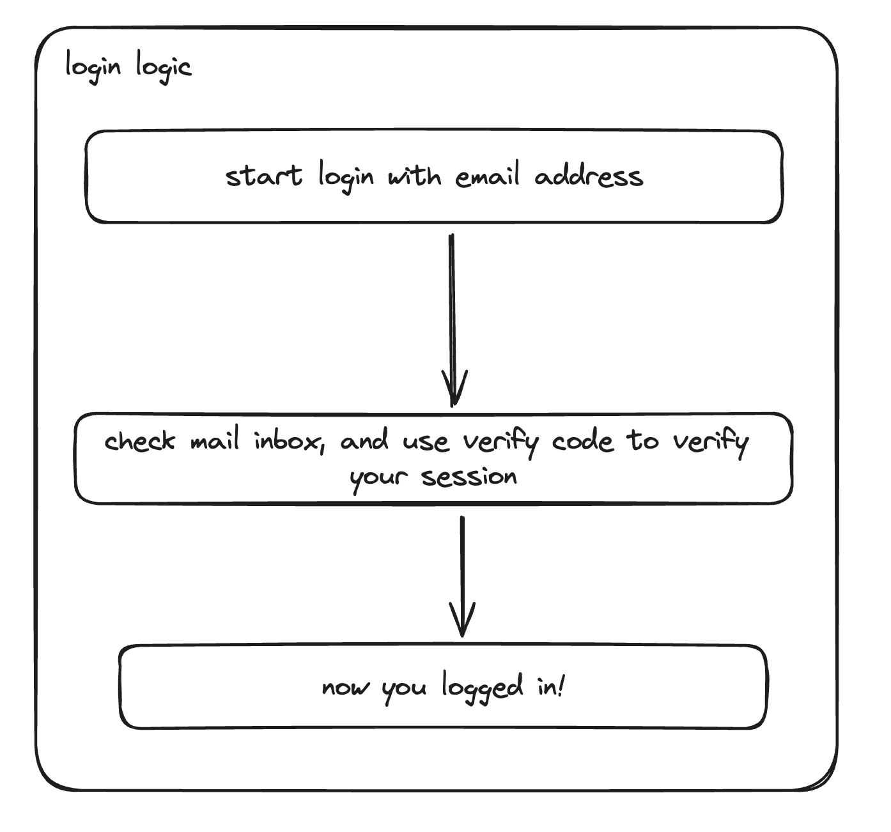

# Teknasyon Banking API

This is a simple banking API that allows you to create, update, delete and list bank accounts, load money into them and transfer money between them.

## Table of Contents
- [Teknasyon Banking API](#teknasyon-banking-api)
  - [Table of Contents](#table-of-contents)
  - [Features](#features)
  - [Installation](#installation)
  - [Usage](#usage)
    - [SMTP Credentials](#smtp-credentials)
    - [Authentication](#authentication)
    - [Load Balancing](#load-balancing)
  - [License](#license)

## Features

The project has the following features:

- **Account Management**
  - Create a new account
  - Freeze, Lock, Suspend and Activate an account
  - Load money into an account
  - Withdraw money from an account
- **Transfer Management**
  - Transfer money between accounts
- **Transaction Management**
  - List transactions of an account
  - List transactions between two dates
  - List transactions with filters
- **Authentication**
  - Passwordless Architecture
  - Login with email and OTP
  - Register with email and verify account
- **Database and Security**
  - PostgreSQL as database, indexed and normalized
  - Redis for session management
  - JWT RS256
- **Scalability**
  - Scale with Docker Swarm
  - Load balancing with Docker Swarm
- **Advanced options**
  - Email notification for incoming/outgoing transactions
  - Processing fee for each transaction

## Installation

To install the project, you need to have Docker, Docker Swarm and Docker Compose installed on your machine. You can install them from the following links:

- [Docker](https://docs.docker.com/get-docker/)
- [Docker Swarm](https://docs.docker.com/engine/swarm/)
- [Docker Compose](https://docs.docker.com/compose/)
- [Postman](https://www.postman.com/downloads/)

After installing the required tools, you can enable the swarm mode on your machine by running the following command:

```bash
docker swarm init
```

Then, you will be able to start the project with the one following command:

```bash
make start
```

This command will start the project with the following services:

- **API**: The main API service that serves the endpoints.
- **Database**: The PostgreSQL database service that stores the data.
- **Redis**: The Redis service that stores the session data.
- **JWT**: The JWT service that generates and verifies the JWT tokens.
- **Environment**: The environment service that loads the environment variables.

You can access the API documentation from the postman collection file in the `docs` folder.

## Usage

You can use the following commands to manage the project:

- **Start the project**: `make start`
- **Stop the project**: `make stop`
- **Environment Variables**: `make env`
- **JWT Secrets**: `make jwt`
- **Docker Network**: `make network`
- **Register JWT to Docker Secrets**: `make secret-register`
- **Restart the project**: `make reload`
- **Generate Requirements**: `make reqs`
- **Clean the project**: `make clean`,

### SMTP Credentials

The project uses SMTP for sending emails. You can set the SMTP credentials in the `.env` file. The following variables are required:

- `SMTP_HOST`: The SMTP host address
- `SMTP_PORT`: The SMTP port
- `SMTP_FROM`: The SMTP from address
- `SMTP_SENDER`: The SMTP username
- `SMTP_PASSWORD`: The SMTP password

If you in the Teknasyon Team, contact me for testing credentials.

### Authentication

The project uses a passwordless architecture for authentication.

- **Register**: The user sends an email to the API to get an Verification Code. The API sends a Verification Code to the user's email. The user sends the Verification Code to the API to register.
- **Login**: The user sends an email to the API to get an OTP. The API sends an OTP to the user's email. The user sends the OTP to the API to get a JWT token.

Register Logic:



Login Logic:




### Load Balancing

The project uses Docker Swarm for load balancing. You can scale the API service with the following command:

```bash
docker service scale 9ssi7banking=3
```

This command will scale the API service to 3 replicas. You can check the status of the services with the following command:

```bash
docker service ls
```

You can access the API from the following URL:

```bash
http://localhost:4000
```


## License

This project is licensed under the Apache License 2.0. See the [LICENSE](LICENSE) file for details.